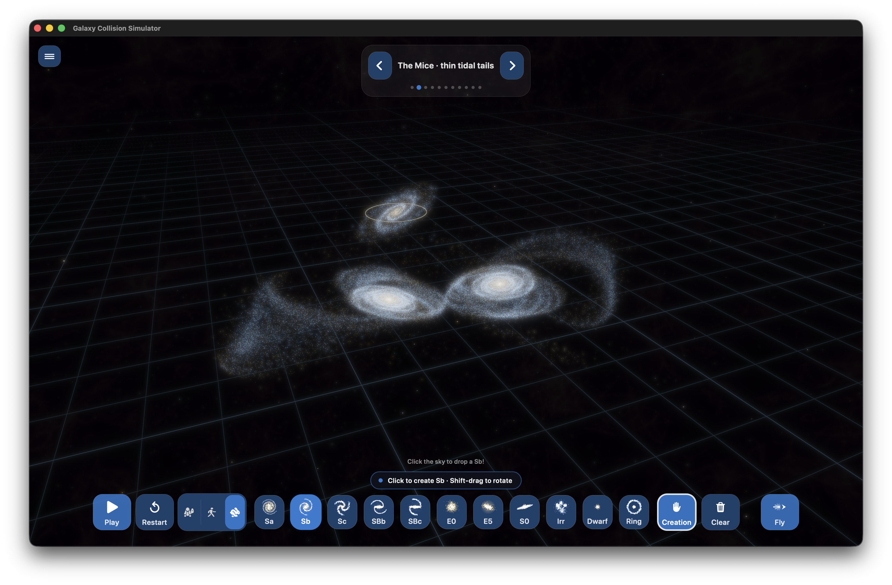
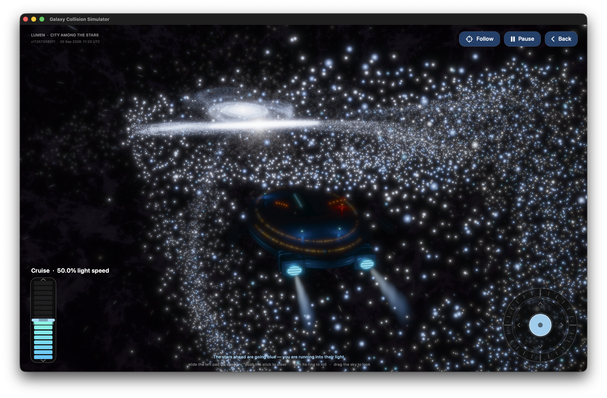
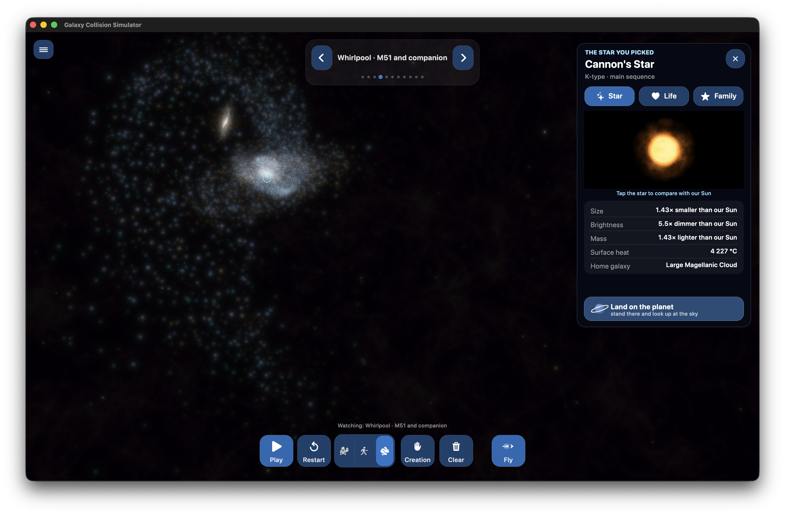
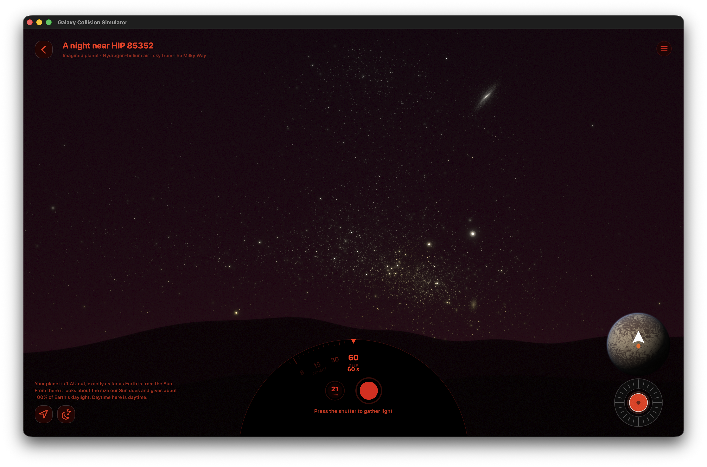

# GalaxySim

### A little spaceship. A sky full of “what if?”

What happens when two galaxies meet? What would the stars look like near the
speed of light? And what kind of night sky could you photograph from another world?

**GalaxySim is a space playground for curious kids, families, and adults who
never stopped looking up.** Make a cosmic mess, take a spaceship through it,
and find somewhere beautiful to stop.

<table>
<tr>
<td width="50%"><br><b>Make galaxies dance.</b></td>
<td width="50%"><br><b>Take the scenic route through space.</b></td>
</tr>
<tr>
<td width="50%"><br><b>Every star has a story.</b></td>
<td width="50%"><br><b>Find your favourite night sky.</b></td>
</tr>
</table>

## Your universe, your adventure

- **Create a cosmic collision.** Pick galaxies, place them, and press Play. Watch
  their shapes stretch into bridges, tails, and new patterns. Restart and try
  another “what if?”
- **Fly among the stars.** Pilot LUMEN, a huge ship with glowing windows and
  engines. Look around as near-light-speed effects bend the sky and shift its
  colours. Pause when you find a view worth sharing.
- **Meet a star.** Click one to follow it and explore its type, size, brightness,
  and possible life story. Tap its animated portrait to compare it with our Sun.
- **Go somewhere nobody has stood.** Visit an imagined planet, push the little
  flight pad to find your skyline, and let go to stop. The sky and horizon move
  together as you explore.
- **Become a cosmic photographer.** Choose an exposure, press the shutter, and
  gather starlight. Bring up the sun without losing your composition, or return
  to the quiet of night.

Big buttons, a playful pace, and room to explore together. There is no score to
chase: the reward is the next surprising view.

## Try it on your Mac

Built for **Apple Silicon Macs**, including the M1 MacBook Air. Requires
**macOS 15 or later** and a Swift 6 toolchain (Xcode). This is a work in progress;
performance depends on your Mac and the scene you create.

From a local copy of this repository:

```sh
swift build -c release
./.build/release/GalaxySim
```

To assemble a local app bundle, run `./rebuild-app.sh`.

Start with **Play**, try **Creation**, then click a star or choose **Fly**.
The menu also contains an engineering interface for anyone who enjoys the knobs.

## A playground inspired by real science

Gravity drives the galaxy encounters, and relativistic optics shape the flight
view. The simulator uses approximations to make exploration interactive.
Selected stars have representative properties and life stories; the planets
and their weather are imagined, not observations of real worlds. Day/night in
photography mode is a composition-friendly lighting control.

## Curious about the machinery?

Swift, Metal, GPU gravity, procedural planets, and plenty of experiments live
under the hood. Read the [controls and technical guide](TECHNICAL_GUIDE.md) for
shortcuts, algorithms, rendering details, benchmarks, and current limitations.

Source code is available under the [MIT license](LICENSE).
